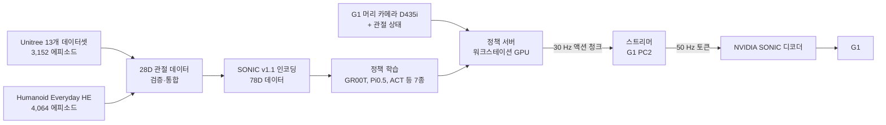
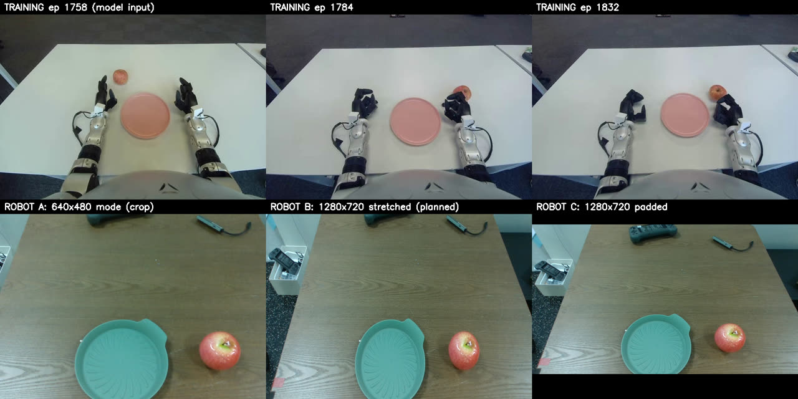
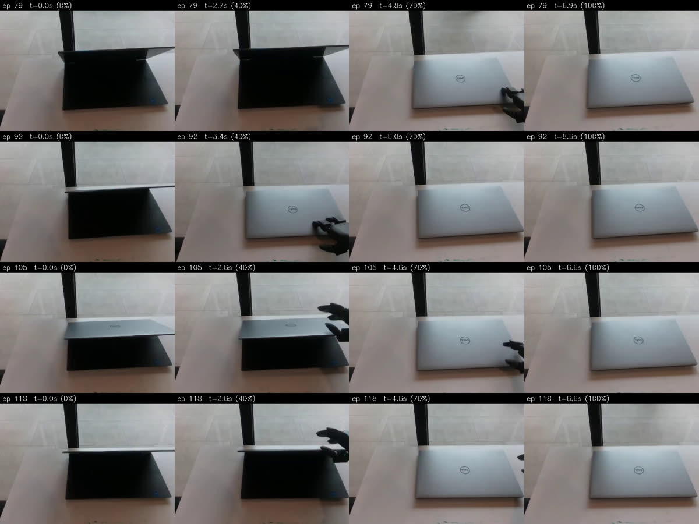
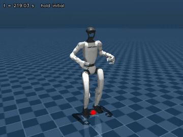
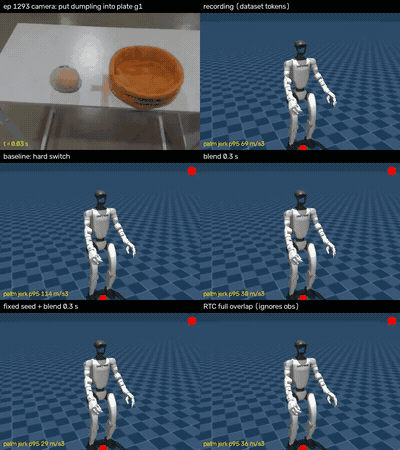

# G1 Dex3 × SONIC 구현 로그 (2026-09-22 ~ 10-01)

- 작성일: 2026-10-01
- 브랜치: `feat/g1-combined-eval`
- 범위: Unitree G1(Dex3 손) 원격조작 데이터로 VLA 정책을 학습하고, NVIDIA GEAR-SONIC 전신 제어기를 거쳐 실제 로봇에서 돌리기까지의 작업 기록

## 요약

- **파이프라인은 실제 로봇에서 끝까지 돌아갑니다.** 정책 서버(워크스테이션 RTX 3060), 스트리머와 카메라(G1 PC2), NVIDIA 제어기를 연결해 실기 16회를 주행했습니다. 안전장치가 작동해 멈춘 주행은 1회였습니다.
- **막힌 곳은 GR00T의 동작 품질입니다.** 노트북 덮기 과제에서 목표 위치까지는 손을 뻗지만, 팔이 1 Hz 정도로 앞뒤로 떨립니다. 학습 데이터를 그대로 재생하면 부드럽게 움직이므로, 떨림은 데이터나 로봇이 아니라 모델 출력에서 나옵니다.
- **원인 후보는 학습 레시피입니다.** 우리가 쓴 학습 설정을 각 정책의 공식 레시피와 비교해 보니, 모든 파운데이션 모델이 공식 레시피보다 4~190배 적은 샘플로 학습돼 있었습니다. GR00T는 Hub ID로 불러올 때 NVIDIA 전처리가 아니라 LeRobot 기본 전처리로 조용히 바뀌는 문제도 있었습니다.
- **현재는 7개 정책 × 2개 데이터셋을 공식 레시피로 다시 학습하고 있습니다.** H100 GPU 0과 6에서 큐로 돌리고 있습니다. HE 데이터셋의 GR00T, ACT, Pi0.5는 학습을 마쳤습니다.
- **10-01에는 Unitree 데이터의 손상 프레임을 고쳤습니다.** 오른손 상태값이 ±3000까지 튀는 프레임 267개(40개 에피소드)를 보간으로 고치고 통계를 다시 계산했습니다. 손상 데이터로 학습한 모델은 모두 지웠고, Unitree 재학습을 다시 시작했습니다.

## 무엇을 만들고 있나

G1이 테이블 앞에 서서 사과를 접시에 옮기거나 노트북을 덮는 식의 조작 과제를 하도록 만드는 것이 목표입니다. 다리와 균형은 NVIDIA의 SONIC 전신 제어기가 맡고, 우리가 학습한 정책은 팔과 손의 움직임만 정합니다.

정책 출력은 두 가지 형태를 지원합니다.

- **78D 경로:** SONIC 토큰 64개 + Dex3 손 관절 14개. 학습 데이터의 팔 동작을 미리 SONIC 인코더로 토큰화해 둡니다.
- **28D 경로:** 팔 14 + 손 14 관절을 그대로 출력하고, 실행할 때 토큰으로 바꿉니다.

Dex3 손은 SONIC을 거치지 않고 관절값을 바로 보냅니다.

## 타임라인

| 날짜 | 한 일 |
| --- | --- |
| 09-22 | G1 Dex3 28D 관절 데이터와 SONIC 학습 파이프라인 구축 |
| 09-23~24 | SONIC 왕복 오차 분석. 변환기의 속도 제한을 끄고, 30 Hz 토큰을 실행 시 50 Hz로 보간하는 방식 결정 |
| 09-25 | 학습한 정책을 NVIDIA 공식 배포 코드로 스트리밍. 관측 상태를 SONIC이 실제 도달한 자세로 재표기 |
| 09-26~27 | 테이블에 손이 닿지 않는 시작·종료 경로 플래너. 로봇 쪽 스트리머와 GPU 정책 서버 분리 |
| 09-28 | 28D 정책의 SONIC 스트리밍, Unitree+HE 결합 학습 평가, PC2용 경량 스트리머와 카메라 발행기, 첫 배포용 안전장치 |
| 09-28~29 | 실제 G1 주행 01~17회. GR00T 떨림 문제 발견 |
| 09-29 | Isaac-GR00T 공식 학습과 비교해 GR00T 전처리 버그 수정. 전 정책 공식 레시피 재학습 큐 시작. 잘못된 레시피로 학습한 기존 모델 삭제 |
| 09-30 | torchcodec 디코더 메모리 누수로 H100 전체가 멈춤. 원인 측정 후 컨테이너 설정으로 막음. Unitree 데이터 손상 프레임 발견 |
| 10-01 | Unitree 데이터 수정, 손상 데이터로 학습한 모델 삭제, Unitree 재학습 재시작 |

## 1주차 (09-22~27): 데이터와 SONIC 경로

1주차 작업은 별도 문서 `docs/research/2026-09-28-g1-dex3-sonic-implementation-ko.md`에 자세히 정리돼 있습니다. 여기서는 결과만 짧게 적습니다.

| 문제 | 해결 | 결과 |
| --- | --- | --- |
| 관절 동작을 SONIC 토큰으로 바꾸면 손바닥 궤적이 원본에서 벗어남 | 변환기의 팔·손 속도 제한을 끄고, 실행 시 다음 토큰을 미리 보고 30→50 Hz 선형 보간 | Unitree 손바닥 오차 p95 3.07 cm. 공식 디코더 기준 최악 에피소드 오차 26.9 → 5.0 cm |
| 같은 토큰이라도 SONIC이 원본과 다른 팔 자세를 선택해, 폐루프에서 관측이 학습 데이터와 어긋남 | SONIC으로 실제 도달한 팔 자세를 `observation.state`에 다시 기록한 `sonicstate` 데이터셋으로 재학습 | 시뮬레이션 폐루프에서 GR00T가 가장 좋은 손바닥 추종 |
| HE 영상의 키프레임 간격이 길어 무작위 프레임 디코딩이 느림 | AV1(`g=2`, CRF 30)로 재인코딩 | DataLoader 27 → 429 샘플/초, ACT 학습 1.3 → 8.7 스텝/초 |
| 테이블 가까이에서 SONIC 기본 자세로 바꾸면 손이 테이블에 부딪힘 | 테이블을 피하는 팔 경로를 계획·인코딩해 시작하고, 종료할 때는 역경로로 플래너 모드 복귀 | 높이 80 cm, 거리 5 cm 테이블 시뮬레이션에서 시작·종료 접촉 없음 |
| 로봇 PC에는 큰 정책을 돌릴 GPU가 없음 | ZMQ로 로봇 쪽 스트리머와 GPU 정책 서버 분리. 첫 청크를 기다리는 동안 정지 토큰을 계속 보냄 | 청크 왕복 약 0.22초 |

## 실제 로봇 첫 주행 (09-28~29)

### 구성

- **정책 서버:** 워크스테이션 RTX 3060(12 GB). GR00T 체크포인트는 float32로 12.6 GB라 그대로는 안 들어갑니다. 파인튜닝 때 백본을 얼려 두었기 때문에 백본만 bf16으로 올려도 가중치 손실이 없습니다. 이렇게 9.6 GB로 줄였고, 청크 하나에 0.19~0.22초 걸립니다.
- **G1 PC2(Orin NX):** torch 없이 도는 경량 스트리머와 카메라 발행기. 스트리머가 한 코어의 19%, 메모리 70 MB를 씁니다. PC2 전체 사용률은 8코어 기준 15% 아래입니다.
- **네트워크:** Wi-Fi LAN, RTT 평균 3.9 ms, 청크 왕복 0.25초.
- 기존 `run_g1_server.py --camera`는 카메라만 켜는 게 아니라 로봇 모션 모드를 해제하고 `rt/lowcmd`까지 건드립니다. 제어 기능이 없는 카메라 전용 발행기(`g1_head_camera_server.py`)를 따로 만들었습니다.

### 카메라 문제: Unitree 모델은 처음 보는 화면을 봅니다

G1 머리 카메라는 RealSense D435i 하나입니다. Unitree 데이터셋은 넓은 스테레오 카메라로 찍어서 양팔과 몸통, 테이블 끝까지 보입니다. 같은 사과 과제라도 화면이 완전히 다릅니다.

반대로 HE 데이터셋의 `egocentric` 카메라는 D435i의 640×480 모드와 거의 같습니다. 시야가 좁고, 몸은 안 보이고, 테이블 끝이 화면 아래 1/3에 걸립니다. 그래서 실기 주행은 HE로 학습한 모델 위주로 했습니다.

### HE 정책은 시작 자세가 달라야 합니다

HE 에피소드는 팔을 낮게 내린 자세에서 시작하고, 테이블도 골반에서 30 cm 이상 떨어져 있습니다. Unitree용 테이블 시작 경로(테이블 5 cm 거리)를 그대로 쓰면 HE 모델이 손을 테이블에 박았습니다. 시뮬레이션에서 GR00T는 테이블 접촉 10회, ACT는 한쪽 발이 들렸습니다.

NVIDIA 플래너의 기본 자세에서 바로 시작하는 `--start planner` 옵션을 만들고 테이블을 25 cm 더 멀리 두었습니다. 그 뒤로 시뮬레이션 4회 모두 발이 땅에 붙어 있었고, 기울기는 2.4~3.7°였습니다.

### 주행 결과

| 주행 | 모델 | 과제 | 결과 |
| --- | --- | --- | --- |
| 01~03 | 결합 GR00T (카메라 1대) | 사과 옮기기 | 전 주기 완료. 시작 경로에서 왼손이 테이블 다리에 걸림. 물체 접촉 없음 |
| 05~07 | HE ACT | 오리 밀기 | 부드러움(팔 속도 1.33 rad/s 이하). 오른손이 다가갔지만 접촉 없음 |
| 08 | HE GR00T | 오리 밀기 | 약 80초 뒤 상태 지연 감시(0.22초)가 작동해 정지 |
| 09~10 | HE GR00T | 오리 밀기 | 팔이 앞뒤로 왕복. 청크가 바뀔 때마다 토큰 변화 제한에 걸림 |
| 11~14 | HE ACT | 노트북 덮기 | 손이 14~33 cm까지만 나감(학습 데이터는 39~44 cm). 노트북에 닿지 못함 |
| 15~16 | HE GR00T | 노트북 덮기 | 손이 41~43 cm까지 나가 노트북에 닿음. 손바닥 jerk p95가 ACT의 4~8배 |

정리하면 ACT는 부드럽지만 목표까지 못 가고, GR00T는 목표까지 가지만 거칠게 움직였습니다.

학습 데이터의 노트북 덮기 장면은 아래와 같습니다.

> 📹 실기 주행 영상 첨부 자리: run05~07(HE ACT, 오리 밀기), run15~16(HE GR00T, 노트북 덮기)

### 첫 배포용 안전장치

- **토큰 변화 제한(`--max-token-step`, 기본 꺼짐):** 빠른 움직임은 주로 청크가 바뀌는 순간에 나왔습니다. 청크 안에서는 토큰이 한 스텝에 0.038 이하로 움직이는데, 청크 경계에서는 중앙값 0.09, 최대 0.25까지 튀었습니다. 0.05로 제한하면 시뮬레이션 최고 팔 속도가 4.51 → 2.17 rad/s로 내려갑니다.
- **관절 감시(기본 켜짐):** 측정한 팔 관절 속도가 6 rad/s를 넘거나 학습 범위를 0.15 rad 넘게 벗어나면 정상 종료 경로로 빠집니다.
- **상태·청크 지연 감시:** 오래된 상태나 청크가 들어오면 종료합니다. run08에서 실제로 작동했습니다.
- 테이블 시작 경로는 손바닥이 몸 옆으로 17~63 cm까지 쓸고 지나갑니다. 테이블 다리는 ±65 cm 밖에 두어야 합니다(run01~03에서 걸림). 관절 감시는 시작 경로에는 적용되지 않습니다.

## GR00T 떨림 문제 (09-29)

### 데이터는 부드럽습니다

정책 없이 학습 데이터의 토큰을 NVIDIA 공식 배포 시뮬레이션에서 그대로 재생해 봤습니다. 세 에피소드 모두 떨림이 없었고, 손바닥 오차는 p50 1.7~3.3 cm였습니다.

### 모델 출력은 이미 떨립니다

녹화된 HE 미학습 에피소드 6개에서 0.4초마다 청크를 예측하게 하고(오픈루프), 액션 표준편차 단위로 측정했습니다. 화면도 HE 카메라 그대로라 카메라 차이는 없는 조건입니다.

| 모델 | 연속 청크 간 불일치 | 청크 경계 점프 | 청크 내부 스텝 | 녹화 데이터 스텝 |
| --- | --- | --- | --- | --- |
| GR00T | 0.238 | 0.211 | 0.033 | 0.019 |
| GR00T, 노이즈 시드 고정 | 0.152 | 0.125 | 0.032 | 0.019 |
| ACT (같은 데이터) | 0.096 | 0.092 | 0.016 | 0.019 |

GR00T는 청크 경계에서 녹화 데이터 한 스텝의 11배를 점프합니다. 같은 관측에 대해 샘플을 두 번 뽑으면 0.23 std만큼 다른데, 이건 모델의 예측 오차와 비슷한 크기입니다. 0.4초마다 새로 샘플을 뽑으니 목표가 매번 튀는 겁니다. 실제 로봇에서는 폐루프가 이 움직임을 키웁니다. 1~2 Hz 대역 비중이 사람 시연은 4%인데 GR00T 주행은 11~34%였습니다.

### 완화책은 효과가 있지만 근본 해결은 아닙니다

서버의 노이즈 시드 고정(`--noise-seed`)과 스트리머의 청크 블렌딩(`--chunk-blend-s`)을 추가했습니다. 아래 영상은 같은 에피소드를 청크 전환 방식만 바꿔 비교한 것입니다.

시뮬레이션(HE GR00T, 미학습 에피소드 1293 / 1300) 결과입니다.

| 설정 | 손바닥 jerk p95 (m/s³) | 1~2 Hz 비중 | 손바닥 오차 p50 (cm) |
| --- | --- | --- | --- |
| 없음 | 126 / 166 | 2.9 / 3.3% | 4.5 / 3.1 |
| 시드 고정 | 127 / 137 | 1.7 / 1.7% | 6.3 / 4.9 |
| 블렌딩 0.3초 | 46 / 46 | 7.0 / 4.4% | 3.7 / 3.4 |
| 시드 고정 + 블렌딩 | 44 / 43 | 1.6 / 1.0% | 5.9 / 4.1 |

시드 고정 + 블렌딩이 모든 지표에서 가장 부드럽지만, 손바닥 오차가 1~1.5 cm 늘어납니다. 실제 로봇에서 블렌딩만 켰을 때(run17)는 팔 jerk가 절반 아래로 줄었지만 1 Hz 왕복은 오히려 커졌습니다(1~2 Hz 비중 34%). 시뮬레이션은 팔이 움직여도 카메라 화면이 바뀌지 않으니 이 왕복을 과소평가합니다.

### 원인: 학습 레시피

NVIDIA Isaac-GR00T의 공식 SONIC 파인튜닝 설정과 우리 학습을 한 줄씩 비교했습니다. 모델 구조, flow matching 설정, 동결 범위는 같았습니다. 다른 부분은 아래와 같습니다.

| 항목 | Isaac-GR00T | 우리 학습 |
| --- | --- | --- |
| 배치 × 스텝 | 32 × 20K = 64만 샘플 | 4 × 40K = 16만 샘플 (HE 전체의 약 9%) |
| 이미지 | 레터박스, 랜덤 크롭 0.95, ColorJitter | 4:3 화면을 정사각형으로 찌그러뜨림, 증강 없음 |
| 액션 정규화 | q01/q99 | min/max (같은 정규화 오차가 실제 단위로 약 1.6배 큼) |
| 상태 드롭아웃 | 원시 상태 0.2 + 모델 0.2 | 모델만 |
| 워밍업 | 전체 스텝의 5% | 500 스텝 (1.25%) |

이미지, 정규화, 드롭아웃 세 항목이 어긋난 원인은 하나였습니다. LeRobot GR00T 프로세서는 `base_model_path`가 로컬 폴더일 때만 기본 체크포인트의 전처리 설정을 읽습니다. 우리는 Hub ID를 넘겼기 때문에 모든 설정이 LeRobot 기본값으로 조용히 바뀌었습니다. 이 브랜치에서 고쳤습니다(`dfe36b45`). 기존 체크포인트에는 영향이 없습니다.

다른 정책도 같은 기준으로 확인했습니다. 공식 레시피에 가까운 건 ACT 하나였고, 오픈루프에서 가장 부드러운 모델도 ACT였습니다. Pi0.5는 가중치 전체를 bf16으로 학습했고 EMA도 없었습니다. VLA-JEPA는 모든 모듈에 학습률 하나를 썼습니다. VLA-JEPA는 배치 1에서 SONIC 토큰을 아예 못 배웠다가 배치 8로 올리자 손실이 내려가기 시작했는데, 작은 배치가 공통 원인이라는 근거가 하나 더 생긴 셈입니다.

## 공식 레시피로 전 정책 재학습 (09-29 ~ 진행 중)

7개 정책을 HE(카메라 1대, 178만 프레임)와 Unitree(카메라 2대, 259만 프레임) 두 데이터셋에서 각 정책의 공식 배치 × 업데이트 수로 다시 학습하기로 했습니다. 잘못된 레시피로 학습한 기존 모델은 H100에서 모두 지웠습니다.

| 정책 | 업데이트당 배치 (마이크로 × 누적) | 업데이트 수 | 주요 설정 |
| --- | --- | --- | --- |
| GR00T | HE 32 × 1, Unitree 16 × 2 | 20K | lr 1e-4 코사인, 워밍업 5%, 수정한 전처리 |
| ACT | 8 × 1 | 200K | 공식 배치 8 |
| Diffusion | 64 × 1 | 200K | AdamW, EMA, ResNet18 처음부터, GroupNorm |
| Pi0.5 | HE 8 × 4, Unitree 4 × 8 | 30K | fp32 가중치 + bf16 autocast, EMA 0.99, openpi 증강 |
| VLA-JEPA | 8 × 4 | 30K | 모듈별 학습률 (Qwen 1e-5, 헤드 1e-4, predictor 5e-4) |
| MolmoAct2 | 8 × 2 | 50K | 논문의 실기 레시피, 전체 파인튜닝 |
| FastWAM | 8 × 2 | 30K | 논문의 실기 레시피, bf16, gradient checkpointing |

코드 변경은 세 가지입니다.

- `dfe36b45`: GR00T 프로세서가 Hub ID에서도 NVIDIA 전처리를 쓰도록 수정
- `b01a01db`: VLA-JEPA 모듈별 학습률(`optimizer_module_lrs`)
- `ceb40b77`: `AdamWConfig.foreach` 옵션. fp32 Pi0.5 + EMA를 80 GB에 올리려면 꺼야 합니다

GPU 하나당 큐 하나(`official_queue.sh`)로 돌립니다. 짧은 smoke 학습이 통과해야 본 학습이 시작되고, 큐 파일에 줄을 추가하면 다음 작업으로 이어집니다.

### 10-01 오전 상태

| 정책 | HE | Unitree |
| --- | --- | --- |
| GR00T | 완료 (20K). 오픈루프 평가 중 | 수정된 데이터로 재학습 중 (10-01 10:30 KST 시작) |
| ACT | 완료 (200K). 평가 전 | GPU 6 대기 |
| Diffusion | GPU 6 대기 (처음부터 다시) | GPU 6 대기 |
| Pi0.5 | 완료 (09-30) | GPU 0 대기 |
| VLA-JEPA | GPU 0 큐에서 진행 | GPU 0 대기 |
| MolmoAct2 | GPU 0 대기 | GPU 0 대기 |
| FastWAM | GPU 0 대기 | GPU 0 대기 |

GPU 0 큐는 전부 끝나는 데 8~9일 정도 걸릴 것으로 봅니다. MolmoAct2와 FastWAM 속도는 아직 재지 않았습니다. 80 GB GPU를 하나 더 쓸 수 있으면 4일 정도 줄일 수 있습니다.

### 사고 기록

**09-30: H100 전체가 멈췄습니다.** HE Diffusion 학습의 DataLoader 워커 8개가 호스트 메모리를 약 800 GB까지 먹었습니다. 9.5시간 동안 호스트가 스왑 없이 버벅였고, 다른 사용자 작업도 같이 멈췄습니다.

원인은 torchcodec의 디코더 캐시입니다. 기본값이 디코더 100개인데 HE는 영상 파일이 4,064개라 거의 매 샘플마다 캐시에서 밀려납니다. 밀려난 디코더는 메모리를 돌려주지 않아서 샘플당 0.7 MB씩 쌓였습니다. 코드는 바꾸지 않고, 모든 학습 컨테이너에 `LEROBOT_VIDEO_DECODER_CACHE_SIZE=5000`과 메모리 상한을 걸었습니다. 이제 누수가 나도 그 작업 하나만 죽습니다.

**09-30 밤: Unitree 작업이 전부 실패했습니다.** Unitree 영상은 원본 데이터 폴더로 가는 심볼릭 링크인데, 새로 만든 컨테이너에 그 폴더를 마운트하지 않았습니다. 데이터셋이 Hub 다운로드로 넘어가려다 오프라인 모드에서 실패했습니다. 마운트를 추가해 컨테이너를 다시 만들었습니다.

**09-30 ~ 10-01: Unitree 데이터 손상.** 다른 작업(Psi0/XR-1)을 하던 중, Unitree 데이터에서 오른손 상태값이 ±3000까지 튀는 프레임을 발견했습니다. 이 값은 저장된 통계에도 들어가 있었습니다. 10-01에 상태 차원 24~27의 267개 프레임을 시간 방향으로 선형 보간해 고치고, 통계를 다시 계산했습니다. 다시 스캔했을 때 손상 프레임은 없었습니다. 손상 데이터로 학습한 Unitree GR00T와 ACT는 지우고 다시 큐에 넣었습니다. 워크스테이션에 있던 결합 GR00T 등 손상 데이터 기반 사본도 모두 지웠습니다.

## 배운 것

- **LeRobot 스케줄러는 마이크로 배치마다 한 스텝씩 갑니다.** 그래디언트 누적이 K이면 `steps`, 워밍업, 감쇠를 모두 K배로 잡아야 합니다. EMA는 옵티마이저 스텝마다 갱신됩니다. 첫 Pi0.5 학습은 이걸 놓쳐서 스케줄이 4배 빨랐고, 중간에 멈췄습니다.
- **정책 프리셋은 `optimizer`/`scheduler` 설정을 덮어씁니다.** 프리셋을 끄면 모듈별 학습률 그룹도 사라집니다. 그래서 VLA-JEPA와 MolmoAct2는 프리셋을 켠 채로 둡니다.
- **GR00T 워밍업은 `--steps`가 아니라 `policy.max_steps`를 봅니다.** 두 값을 같게 맞춰야 합니다.
- **오픈루프 오차 순위와 폐루프 성능 순위는 다릅니다.** 오픈루프에서는 ACT가 가장 정확했지만, 시뮬레이션 폐루프에서는 GR00T가 앞섰습니다. 실기에서는 GR00T만 목표에 닿았습니다.
- **학습 컨테이너는 처음부터 디코더 캐시 변수, 메모리 상한, 원본 데이터 마운트를 걸고 만듭니다.**

## 다음 할 일

1. 재학습이 끝난 모델부터 오픈루프 부드러움을 먼저 봅니다(`openloop_smooth.py`). GR00T 목표는 연속 청크 불일치를 0.24에서 ACT 수준인 0.10 근처로 낮추는 것입니다.
2. 통과한 모델만 시뮬레이션(플래너 시작, 테이블 25 cm)을 거쳐 실기로 갑니다. 그 결과를 보고 시드 고정이나 블렌딩이 계속 필요한지 정합니다.
3. Unitree 과제의 카메라 차이를 메웁니다. D435i로 원격조작 시연을 새로 녹화해 파인튜닝할 계획입니다.
4. 시작·종료 경로에서 팔이 걸리는 상황을 감지하고(계획 경로와 측정값 비교), 비정상 종료 때도 스트리머 로그를 저장하게 합니다.
5. 재학습한 Pi0.5(이전 9.4 GB)와 MolmoAct2(이전 12.7 GB, 그대로는 안 들어감)가 3060에 올라가는지 확인합니다.
6. 업스트림 보고 후보: torchcodec 캐시 누수, GR00T 프로세서의 Hub ID fallback.

## 코드와 상세 문서

| 영역 | 경로 |
| --- | --- |
| 데이터 준비·SONIC 변환 | `examples/g1_dex3_training/prepare_joint_dataset.py`, `prepare_sonic_dataset.py`, `sonic_state_relabel.py` |
| 학습 큐 | `examples/g1_dex3_training/official_queue.sh` |
| 평가 | `ho5_openloop_eval.py`, `openloop_smooth.py`, `robot_run_smoothness.py`, `sonic_official_sim_eval.sh` |
| 실기 실행 | `sonic_policy_server.py`, `sonic_policy_streamer.py`, `g1_head_camera_server.py`, `g1_head_camera_viewer.py` |
| GR00T 전처리 수정 | `src/lerobot/policies/groot/processor_groot.py` |
| 상세 기록 | `docs/research/` 아래 2026-09-23 왕복 검증, 09-29 실기 첫 주행, 09-29 GR00T 떨림 이슈, 09-30 재학습 인수인계 문서 |
