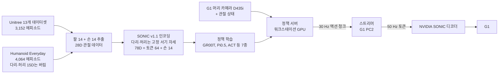

# G1 Dex3 × SONIC 구현 로그

- 기간: 2026-09-22 ~ 10-01 (최종 갱신 10-01)
- 브랜치: `feat/g1-combined-eval`
- 목표: Unitree G1(Dex3 손)이 테이블 앞에서 조작 과제를 하도록, 원격조작 데이터로 VLA 정책을 학습하고 NVIDIA GEAR-SONIC 전신 제어기를 거쳐 실제 로봇에서 실행합니다.

## 지금 어디까지 왔나

- **파이프라인은 실제 로봇에서 끝까지 돕니다.** 실기 주행은 run01부터 run19까지 진행했습니다.
- **막힌 곳은 GR00T의 동작 품질입니다.** 목표에는 손이 닿지만, 청크가 바뀔 때마다 팔이 튀고 1 Hz 정도로 앞뒤로 흔들립니다.
- **학습 레시피를 고쳐도 떨림이 남았습니다.** 공식 레시피로 재학습하자 청크 안의 움직임은 좋아졌지만, 청크마다 새로 뽑는 샘플의 편차는 그대로였습니다. NVIDIA가 권하는 RTC는 모델이 화면을 무시하게 만들어서 쓸 수 없었습니다.
- **7개 정책 × 2개 데이터셋 재학습이 H100에서 돌고 있습니다.** 10-01에 Unitree 데이터의 손상 프레임을 고치고 Unitree 재학습을 다시 시작했습니다.

## 페이지 목록

| # | 마일스톤 | 기간 | 한 줄 요약 |
| --- | --- | --- | --- |
| [01](01-first-implementation.md) | 첫 구현: 28D 데이터와 SONIC 변환 | 09-22~24 | 변환기 속도 제한을 끄자 SONIC 왕복 오차가 기준(손바닥 p95 5 cm)을 통과 |
| [02](02-sim-deployment-prep.md) | 시뮬레이션 배포 준비 | 09-25~27 | 상태 재표기, 테이블 시작·종료 경로, 정책 서버 분리. GR00T가 시뮬레이션 1위 |
| [03](03-28d-and-combined-training.md) | 28D 경로와 결합 학습, 실기 준비물 | 09-24~28 | 28D 정책도 SONIC으로 실행. Unitree+HE 결합은 효과 없음. PC2 경량 스트리머와 안전장치 |
| [04](04-first-real-robot-runs.md) | 실제 로봇 첫 주행 | 09-28~29 | run01~17. Unitree 모델은 카메라 차이, HE GR00T는 목표에 닿지만 거칠게 움직임 |
| [05](05-groot-jerk-cause.md) | GR00T 떨림: 원인 찾기 | 09-29 | 데이터는 부드럽고 모델 출력이 떨림. 학습 샘플 부족과 GR00T 전처리 버그 발견 |
| [06](06-official-recipe-retraining.md) | 공식 레시피로 전 정책 재학습 | 09-29~ | 14개 학습을 GPU별 큐로 진행. 스케줄러 함정 정리 |
| [07](07-retrained-groot-and-rtc.md) | 재학습한 GR00T도 떨린다: RTC 시도와 실패 | 09-30 | 원인은 샘플 편차. RTC는 점프를 줄이지만 오차가 1.4~3.3배로 늘어 포기 |
| [08](08-h100-freeze-torchcodec-leak.md) | H100 멈춤 사고 | 09-30 | torchcodec 디코더 캐시 누수로 호스트 메모리 800 GB 사용. 컨테이너 설정으로 막음 |
| [09](09-unitree-dataset-bug.md) | Unitree 데이터 손상과 재학습 | 09-30~10-01 | 손상 프레임 267개 수정, 해당 모델 삭제, Unitree 재학습 재시작 |

## 시스템 구성

- 다리와 균형은 SONIC이 맡고, 정책은 팔과 손 동작만 정합니다.
- Dex3 손은 SONIC을 거치지 않고 관절값을 바로 보냅니다.
- 정책은 0.4초마다 1.33초 분량의 청크를 내고, 스트리머가 30 Hz 토큰을 50 Hz로 보간해 보냅니다.

## 타임라인

| 날짜 | 한 일 | 페이지 |
| --- | --- | --- |
| 09-22 | 28D 관절 데이터와 SONIC 학습 파이프라인 구축 | 01 |
| 09-23~24 | SONIC 왕복 오차 분석, 속도 제한 해제, 30→50 Hz 보간 결정 | 01 |
| 09-25 | 정책을 NVIDIA 공식 배포 코드로 스트리밍, 상태 재표기, 분위수 통계 수정 | 02 |
| 09-26~27 | 테이블 시작·종료 경로, 정책 서버 분리, 시뮬레이션 순위 | 02 |
| 09-28 | 28D 스트리밍, 결합 학습 평가, PC2 스트리머·카메라, 안전장치 | 03 |
| 09-28~29 | 실기 run01~17, GR00T 떨림 발견 | 04 |
| 09-29 | Isaac-GR00T 비교, 전처리 버그 수정, 공식 레시피 재학습 시작, 기존 모델 삭제 | 05, 06 |
| 09-30 | 재학습 GR00T로 run18~19, RTC 시험, H100 멈춤 사고, Unitree 손상 프레임 발견 | 07, 08, 09 |
| 10-01 | Unitree 데이터 수정, 해당 모델 삭제, Unitree 재학습 재시작 | 09 |

## 다음 할 일

1. 재학습이 끝난 모델마다 오픈루프 부드러움부터 보고, 통과한 것만 시뮬레이션과 실기로 보냅니다.
2. 카메라 화면 차이와 폐루프 피드백 중 무엇이 실기 흔들림을 키우는지 가르는 시험을 돌립니다.
3. 새 GR00T로 노이즈 고정 + 블렌딩을 실기에서 시험하고, Pi0.5에서도 같은 샘플 편차가 보이는지 확인합니다.
4. Unitree 과제는 D435i로 원격조작 시연을 새로 녹화해 카메라 차이를 메웁니다.

## 원문 기록

이 로그는 아래 영문 기록을 정리한 것입니다. 재현 명령, 경로, 세부 조건은 원문을 보세요.

- `docs/research/2026-09-23-sonic-roundtrip-audit.md`: SONIC 변환과 왕복 검증
- `docs/research/2026-09-27-sonic-real-robot-handover.md`: 실기 준비 인수인계
- `docs/research/2026-09-28-sonic-28d-and-combined-handover.md`: 28D 경로와 결합 학습
- `docs/research/2026-09-29-sonic-real-robot-first-runs.md`: 실기 첫 주행
- `docs/research/2026-09-29-issue-groot-jerky-predictions.md`: GR00T 떨림 이슈
- `docs/research/2026-09-29-vla-jepa-sonic-tokens.md`: VLA-JEPA 학습 실패와 원인
- `docs/research/2026-09-30-official-retraining-handover.md`: 공식 레시피 재학습 인수인계
