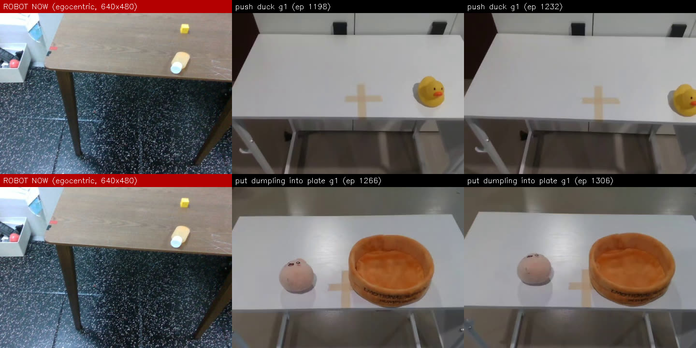

# 04. 실제 로봇 첫 주행

- 기간: 2026-09-28 ~ 09-29
- 한 줄 요약: 실제 G1에서 파이프라인이 끝까지 돌았습니다(run01~17). 이제 문제는 파이프라인이 아니라 두 가지입니다. Unitree 모델은 처음 보는 카메라 화면을 보고, HE GR00T는 목표에는 닿지만 거칠게 움직입니다.

## 구성

| 구성 요소 | 위치 | 측정값 |
| --- | --- | --- |
| 정책 서버 | 워크스테이션 RTX 3060 | GR00T bf16 백본 9.6 GB, 청크 0.19~0.22초 |
| 스트리머, 카메라 발행기, NVIDIA 배포 코드 | G1 PC2 (Orin NX) | PC2 전체 8코어 기준 15% 아래 |
| 네트워크 | Wi-Fi LAN | RTT 평균 3.9 ms, 최대 11 ms, 청크 왕복 0.25초 |

## 카메라: Unitree 모델은 처음 보는 화면을 봅니다

G1 머리 카메라는 RealSense D435i 하나이고 USB 2.0에 붙어 있습니다.

| 모드 | 시야 | 속도 |
| --- | --- | --- |
| 640×480 | 센서 중앙 4:3 크롭 | 30 fps |
| 1280×720 | 전체 폭 (약 69°) | 15 fps (USB 2.0 한계) |

Unitree 데이터셋은 넓은 스테레오 카메라로 찍어서 양팔, 몸통, 테이블 끝이 다 보입니다. 같은 사과 과제라도 로봇 카메라 화면과 전혀 다릅니다.

반면 HE의 `egocentric` 카메라는 D435i 640×480 모드와 거의 같습니다. 시야가 좁고, 몸은 안 보이고, 테이블 끝이 화면 아래 1/3에 걸립니다. 그래서 실기는 HE 모델 위주로 돌렸고, HE 모델에는 640×480 스트림을 `egocentric`이라는 이름으로 넣습니다.

## HE 정책은 시작 자세가 달라야 합니다

HE 에피소드는 팔을 낮게 내린 자세(손바닥 높이 68~70 cm)에서 시작하고, 테이블 끝이 골반에서 30 cm 이상 떨어져 있습니다. [02](02-sim-deployment-prep.md)의 Unitree용 테이블 시작 경로(테이블 5 cm)를 그대로 쓰니, 시뮬레이션에서 HE GR00T는 테이블에 10번 부딪혔고 HE ACT는 한쪽 발이 들렸습니다.

NVIDIA 플래너 자세에서 바로 시작하고 끝내는 `--start planner`를 만들고, 테이블을 25 cm 더 멀리 뒀습니다. 이후 시뮬레이션 4회 모두 발이 땅에 붙어 있었고 기울기는 2.4~3.7°였습니다.

## 주행 기록

| 주행 | 모델 | 과제 | 결과 |
| --- | --- | --- | --- |
| 01~03 | 결합 GR00T (카메라 1대) | 사과 옮기기 | 전 주기 완료, 청크 0.20초. 시작 경로에서 왼손이 테이블 다리에 걸림. 손가락은 허공에서 굽힘 |
| 05~07 | HE ACT | 오리 밀기 | 부드러움(팔 1.33 rad/s 이하). 오른손이 다가갔지만 접촉 없음 |
| 08 | HE GR00T | 오리 밀기 | 약 80초 뒤 상태 지연 감시(0.22초)로 정지. 기록 파일은 끝에만 저장돼 남지 않음 |
| 09~10 | HE GR00T | 오리 밀기 | 팔이 앞뒤로 왕복. 청크가 바뀔 때마다 토큰 변화 제한에 걸림. run10 팔 최고 5.09 rad/s |
| 11~14 | HE ACT | 노트북 덮기 | 오른손이 14~33 cm까지만 나감(학습 데이터는 39~44 cm). 노트북에 못 닿음 |
| 15~16 | HE GR00T | 노트북 덮기 | 오른손이 41~43 cm까지 나가 노트북에 닿음. 대신 거칠게 움직임 |
| 17 | HE GR00T | 노트북 덮기 | 청크 블렌딩 0.3초 시험. [05](05-groot-jerk-cause.md) 참고 |

ACT는 부드럽지만 지시를 무시하고 목표까지 가지 못했습니다. 카메라 차이에 더해 ACT는 언어 입력이 없습니다. GR00T는 목표까지 가지만 거칠었습니다.

학습 데이터의 노트북 덮기 장면입니다.

> 📹 실기 주행 영상 첨부 자리: run05~07 (HE ACT, 오리 밀기), run15~16 (HE GR00T, 노트북 덮기)

## 얼마나 거칠었나

스트리머 로그에서 계산한 값입니다(`robot_run_smoothness.py`). "청크 경계 / 스텝"은 청크가 바뀔 때의 점프와 평소 틱당 변화량이고, 단위는 액션 표준편차입니다.

| 주행 | 모델 | 토큰 경계 / 스텝 | 손 경계 / 스텝 | 팔 속도 p95 (rad/s) | 팔 jerk p95 (rad/s³) | 1~2 Hz 비중 |
| --- | --- | --- | --- | --- | --- | --- |
| 14 | HE ACT | 0.055 / 0.003 | 0.090 / 0.006 | 0.26 | 150 | 8.4% |
| 15 | HE GR00T | 0.191 / 0.018 | 0.312 / 0.036 | 1.69 | 929 | 11.2% |
| 16 | HE GR00T | 0.196 / 0.019 | 0.295 / 0.032 | 1.94 | 1020 | 14.9% |

사람 시연은 팔 속도 p95 1.12 rad/s, 1~2 Hz 비중 4%입니다. GR00T는 청크 경계에서 평소 스텝의 10배 넘게 튀고, 팔이 1 Hz 정도로 앞뒤로 흔들립니다. 이 문제를 [05](05-groot-jerk-cause.md)부터 추적합니다.

## 안전 관련 메모

- 테이블 시작 경로는 손바닥이 몸 옆 17~63 cm까지 쓸고 지나갑니다. 테이블 다리는 ±65 cm 밖에 둬야 합니다. run01~03에서 왼손이 걸려 팔이 3.3 rad/s로 튀었습니다. 관절 감시는 시작 경로에 적용되지 않습니다.
- run08은 상태 지연 감시가 정상적으로 작동한 사례입니다. 다만 스트리머가 기록 파일을 끝에서만 써서, 중간에 멈춘 주행은 텍스트 로그만 남았습니다.

## 관련 코드

- `examples/g1_dex3_training/sonic_policy_streamer.py` (`--start planner`, `--max-token-step`, 관절 감시)
- `examples/g1_dex3_training/robot_run_smoothness.py`
- 상세 기록: `docs/research/2026-09-29-sonic-real-robot-first-runs.md`
