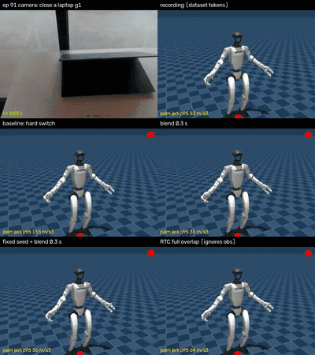

# 07. 재학습한 GR00T도 떨린다: RTC 시도와 실패

- 기간: 2026-09-30
- 한 줄 요약: NVIDIA 레시피로 다시 학습한 HE GR00T도 실기에서 여전히 떨렸습니다. 청크 안의 움직임은 좋아졌지만, 청크가 바뀔 때의 점프는 그대로였습니다. 원인은 학습량이 아니라 청크마다 새로 뽑는 샘플의 편차였습니다. NVIDIA가 권하는 RTC를 시험했는데, 점프는 줄지만 모델이 카메라 화면을 무시하게 돼서 쓸 수 없었습니다.

## 재학습 모델로 실기 주행 (run18~19)

[06](06-official-recipe-retraining.md)에서 가장 먼저 끝난 HE GR00T(20K, 배치 32)를 워크스테이션에 띄워 노트북 덮기를 다시 돌렸습니다. 블렌딩은 일부러 껐습니다. 새 모델에 아직 블렌딩이 필요한지 보려는 것이었습니다.

| 주행 | 모델 | 토큰 변화 제한 | 블렌딩 | 토큰 경계 / 스텝 | 손 경계 / 스텝 | 팔 속도 p95 | 팔 jerk p95 | 1~2 Hz 비중 |
| --- | --- | --- | --- | --- | --- | --- | --- | --- |
| 14 | HE ACT | – | – | 0.055 / 0.003 | 0.090 / 0.006 | 0.26 | 150 | 8.4% |
| 15 | 이전 GR00T | 0.05 | – | 0.191 / 0.018 | 0.312 / 0.036 | 1.69 | 929 | 11.2% |
| 16 | 이전 GR00T | 0.05 | – | 0.196 / 0.019 | 0.295 / 0.032 | 1.94 | 1020 | 14.9% |
| 17 | 이전 GR00T | 0.05 | 0.3초 | 0.018 / 0.025 | 0.032 / 0.035 | 1.98 | 399 | 40.7% |
| **18** | **새 GR00T** | 0.05 | – | **0.172 / 0.014** | **0.229 / 0.029** | **1.90** | **994** | **8.4%** |
| **19** | **새 GR00T** | 0.1 | – | **0.195 / 0.012** | **0.170 / 0.022** | **2.19** | **1123** | **10.2%** |

(팔 속도 rad/s, jerk rad/s³. 사람 시연은 팔 속도 p95 1.12, 1~2 Hz 비중 4%)

- 토큰 경계 점프는 0.17~0.20으로 이전 모델(0.19~0.20)과 거의 같고, ACT의 3.5배입니다.
- 손의 경계 점프는 25~45% 줄었습니다. 손에는 변화 제한이 걸리지 않아서 모델 출력이 가장 그대로 보이는 지표입니다.
- 1 Hz 왕복은 8~10%로 줄었지만 여전히 사람 시연의 두 배입니다.

주행 한두 번씩이라 작은 차이는 잡음으로 봐야 합니다. 그래도 경계 점프는 크고 일관됐습니다.

> 📹 실기 주행 영상 첨부 자리: run18~19 (재학습 HE GR00T, 노트북 덮기)

## 오픈루프로 다시 보기

로봇 없이 같은 미학습 에피소드 6개로 비교했습니다.

| 지표 | 이전 GR00T | **새 GR00T** | ACT | 녹화 데이터 |
| --- | --- | --- | --- | --- |
| 토큰 연속 청크 불일치 | 0.241 | **0.170** | 0.096 | – |
| 손 연속 청크 불일치 | 0.324 | **0.242** | 0.108 | – |
| 토큰 청크 경계 점프 | 0.215 | **0.139** | 0.092 | – |
| 토큰 청크 안 스텝 | 0.034 | **0.023** | 0.016 | 0.019 |
| 토큰 청크 안 곡률 | 0.049 | **0.026** | 0.014 | 0.038 |

재학습은 효과가 있었습니다. 청크 안의 움직임은 녹화 데이터 수준이 됐습니다. 하지만 청크 사이 불일치는 0.17로, 목표로 잡았던 0.10에 못 미칩니다. 경계 점프가 여전히 평소 스텝의 6배라서 실기에서 청크가 바뀔 때마다 튑니다.

## 학습량이 원인인가

노트북 덮기는 HE 124개 과제 중 하나라서, 20K 스텝 동안 약 3,200개 샘플만 봤습니다. 데이터셋 전체로도 0.38 epoch입니다. 그래서 "과제별 학습량이 부족해서 떨린다"는 가설을 직접 시험했습니다. 학습 샘플 수가 다른 세 과제에서 각각 미학습 에피소드 2개로 쟀습니다.

| 과제 (학습 샘플) | 랜덤 노이즈 (실기와 같음) | 노이즈 고정 (관측만 바뀜) | 같은 관측, 두 샘플 차이 |
| --- | --- | --- | --- |
| 노트북 덮기 (3.2K) | 0.183 | 0.142 | 0.129 |
| 오리 밀기 (7.4K) | 0.175 | 0.111 | 0.135 |
| 만두 옮기기 (10.2K) | 0.157 | 0.106 | 0.112 |

(토큰 기준)

- 만두는 노트북보다 샘플이 3.2배 많은데 불일치는 14%만 낮습니다.
- 같은 관측에서 뽑은 두 샘플의 차이는 학습량과 상관이 없습니다. 오리 밀기가 가장 큽니다.
- 노이즈를 고정하면 GR00T도 ACT(0.096)와 비슷한 수준이 됩니다.
- 랜덤 노이즈 불일치는 √(고정 불일치² + 샘플 차이²)와 거의 같습니다. 노트북: √(0.142² + 0.129²) = 0.19, 실측 0.183.

남은 떨림의 절반가량은 **청크마다 새로 뽑는 샘플의 편차**입니다. flow matching 헤드는 시연의 다양성을 재현하도록 학습되므로, 잘 학습할수록 편차가 사라지는 게 아닙니다. 사람 시연은 같은 상황에서도 매번 조금씩 다르기 때문입니다. 손은 거의 전부 샘플 편차입니다.

SONIC 버전 불일치도 확인했습니다. 데이터셋을 만들 때 기록한 인코더·디코더·설정 파일 해시가 PC2 배포 코드에서 쓰는 v1.1 파일과 모두 일치했습니다. 원인에서 뺐습니다.

## NVIDIA는 RTC를 권합니다

Isaac-GR00T 배포 가이드는 떨림을 세 경우로 나눕니다.

| 경우 | 증상 | NVIDIA 권장 해법 |
| --- | --- | --- |
| A | 청크 안에서 떨림 | 학습 부족 또는 데이터 품질. 데이터를 늘리거나 더 학습 |
| **B** | **연속 청크끼리 어긋남** | **상태 상대 액션 + RTC 청크 전략** |
| C | 청크는 부드러움 | 로봇이나 저수준 제어 문제 |

우리는 B입니다. 청크 안 스텝은 녹화 데이터 수준이고, 청크끼리 어긋납니다. 가이드는 "비동기 추론 + RTC가 대개 가장 효과적"이라고 적고 있습니다.

RTC(Real-Time Chunking)는 이전 청크에서 아직 실행하지 않은 부분을 새 청크의 출발점으로 고정하고, 모델은 나머지만 채우게 합니다. 구조상 연속 청크가 맞아떨어집니다. Isaac-GR00T N1.7과 LeRobot 포트 모두 RTC가 구현돼 있는데, NVIDIA의 GR00T-WBC 클라이언트도 우리 스트리머도 쓰지 않고 있었습니다.

## RTC 시험 결과

같은 미학습 에피소드 6개, 오픈루프, 토큰(손) 기준입니다.

| 방식 | 청크 경계 점프 | 녹화 데이터 대비 오차 |
| --- | --- | --- |
| 기준 (하드 전환, 지금 실기 방식) | 0.138 (0.246) | 0.152 (0.273) |
| RTC, 남은 28프레임 전부 고정 | 0.047~0.057 (0.032~0.037) | **0.50~0.54 (0.53~0.56)** |
| RTC, 겹침 8, 고정 6 | 0.112 (0.150) | 0.205 (0.312) |
| RTC, 겹침 12, 고정 6 | 0.095 (0.124) | 0.258 (0.343) |
| RTC, 겹침 8, 고정 0 | 0.091 (0.129) | 0.215 (0.308) |
| 4개 중 이전 청크와 가장 가까운 것 고르기 | 0.120 (0.210) | 0.151 (0.258) |
| **블렌딩 0.3초** | **0.026 (0.049)** | **0.155 (0.273)** |
| **노이즈 고정 + 블렌딩 0.3초** | **0.025 (0.033)** | **0.150 (0.280)** |

- **RTC는 어떤 설정에서도 문제 하나를 다른 문제로 바꿉니다.** 남은 프레임을 전부 고정하면 점프가 65% 줄지만 오차가 3.3배 커지고, 손은 거의 움직이지 않습니다(실행 스텝 0.014, 녹화 데이터 0.063). 겹침을 줄이면 점프는 20~35%만 줄고 오차는 35~70% 늘어납니다.
- 이유는 이렇습니다. 우리는 청크마다 12프레임(0.4초)만 실행하는데, 그 12프레임이 모두 고정 구간 안에 있습니다. 새 청크가 사실상 이전 계획을 베끼고, 새 이미지와 상태는 거의 반영되지 않습니다. 실기라면 부드럽게 움직이지만 보이는 것을 무시하는 로봇이 됩니다.
- 샘플 여러 개 중 고르기(Bidirectional Decoding 방식)는 점프를 13%만 줄였습니다. 샘플들이 모두 이전 계획과 비슷한 정도로 달라서 고를 게 없었습니다.
- **블렌딩은 오픈루프에서 문제를 풉니다.** 점프가 평소 스텝 크기(0.023)까지 내려가고 오차는 기준과 같습니다. RTC와 달리 두 청크 모두 각자의 관측에서 나오고, 전환하는 동안만 섞기 때문입니다.

RTC는 이 모델에서 쓰지 않기로 했습니다.

## 영상으로 비교

오픈루프 결과를 SONIC 디코더로 MuJoCo에서 렌더링했습니다. 왼쪽 위가 모델이 본 카메라 화면, 오른쪽 위가 녹화 데이터 토큰입니다. 아래 네 칸은 하드 전환, 블렌딩 0.3초, 노이즈 고정 + 블렌딩, RTC(전부 고정)입니다. 오른쪽 위의 빨간 점이 깜빡이는 순간이 청크 전환(0.4초마다)입니다.

만두 옮기기(에피소드 1293):

노트북 덮기(에피소드 91):

시뮬레이션 로봇의 손바닥 jerk p95(m/s³)입니다.

| 방식 | 노트북 덮기 | 만두 옮기기 |
| --- | --- | --- |
| 녹화 데이터 | 83 | 69 |
| 하드 전환 | **155** | **114** |
| 블렌딩 0.3초 | 35 | 30 |
| 노이즈 고정 + 블렌딩 | 36 | 29 |
| RTC 전부 고정 | 64 | 36 |

하드 전환은 녹화 데이터의 1.7~1.9배이고, 튀는 순간이 빨간 점과 맞습니다. RTC는 부드럽지만 시간이 갈수록 팔이 녹화 데이터에서 멀어집니다. 렌더링에는 테이블과 물체가 없고, 손가락은 표시용으로 손 액션을 직접 넣었습니다.

## 블렌딩도 실기에서는 부족했습니다

run17(이전 GR00T, 블렌딩 0.3초)에서 팔 jerk는 1,000 근처에서 399로 줄었지만 1~2 Hz 왕복 비중이 11~15%에서 41%로 늘었습니다. 블렌딩은 점프를 미끄러짐으로 바꿀 뿐입니다. 두 계획이 여전히 0.15 std쯤 어긋나 있어서, 0.4초마다 미끄러지는 방향이 뒤집힐 수 있습니다. 오픈루프는 녹화 데이터만 보고 판단하므로 이 왕복을 볼 수 없습니다.

## 남은 가설

오픈루프에서 HE 자체 카메라 화면을 넣으면 새 모델의 출력은 그럴듯합니다. 실기에서 달라지는 건 두 가지입니다.

| 가설 | 근거 |
| --- | --- |
| 카메라 화면 차이 | 언어 입력이 없는 ACT는 실기에서 노트북에 못 닿았음. GR00T의 실기 경계 점프(0.17~0.20)가 오픈루프(0.14)보다 큼. 낯선 화면에서는 샘플이 더 퍼질 수 있음 |
| 폐루프 피드백 | 1~2 Hz 왕복은 진동 패턴이고, 이전 청크의 결과에 다음 청크가 반응하는 피드백 루프에서 흔히 나타남. 낯선 화면만으로는 주기적인 흔들림이 설명되지 않음 |

지연은 원인에서 뺐습니다. 스트리머는 청크에 관측 시점을 찍어 그 시점부터 재생하므로, 계산 시간만큼은 자동으로 건너뜁니다.

두 가설을 로봇을 움직이지 않고 가르는 시험을 준비했습니다. 로봇을 테이블 앞 플래너 자세로 세워 두고, 이미지와 상태를 HE 것과 실기 것으로 바꿔 가며 네 조합에서 샘플 편차와 계획 변화를 잽니다. PC2와 카메라를 다른 팀원이 쓰고 있어서 아직 돌리지 못했습니다. PC2는 함께 쓰는 장비라, 주행 전에 다른 사용자의 카메라 발행기가 카메라와 5556 포트를 잡고 있지 않은지 확인해야 합니다.

## 다음 할 일

1. 위 시각 차이 시험을 돌립니다(로봇과 카메라가 비면 약 5분).
2. 새 GR00T로 노이즈 고정 + 블렌딩을 실기에서 시험합니다.
3. 다른 flow matching 정책(Pi0.5)도 같은 샘플 편차를 보이는지, 결정론적인 ACT 재학습 모델은 어떤지 오픈루프로 확인합니다.

## 관련 코드

- `examples/g1_dex3_training/openloop_smooth.py`, `robot_run_smoothness.py`
- `examples/g1_dex3_training/sonic_policy_server.py` (`--noise-seed`), `sonic_policy_streamer.py` (`--chunk-blend-s`)
- RTC 시험과 렌더링 스크립트는 작업 세션의 임시 폴더에만 있고 저장소에는 아직 없습니다.
